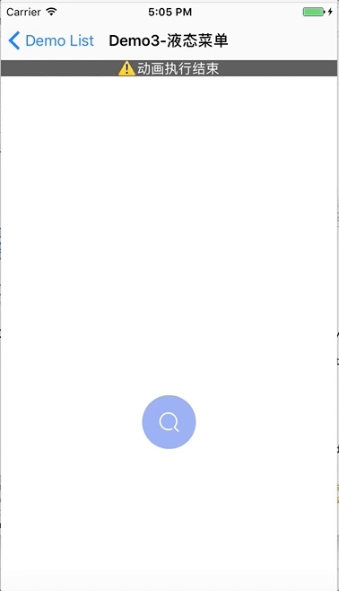

# DYHAnimationDemos
iOS Animation Demos By Dai Yunhao

# demo1 - easy3DTransform

An easy demo to experience 3D transform of iOS.

# demo2 - PaperPlane

An easy demo to make a papaer plane by `CAKeyframeAnimation`.

# demo3 - LiquidMenu

A demo to make a cool liquid menu.(**new version on 2017/04/20 ^ ^**)

# demo4 - SubmitButton

A demo to make a cool submit button.

# demo5 - HelloAnimation

A demo to make a fantastic **“hello”**.

## demo6 - Slow Liquid Ball

use the same tech as demo03, a cool liquid ball.